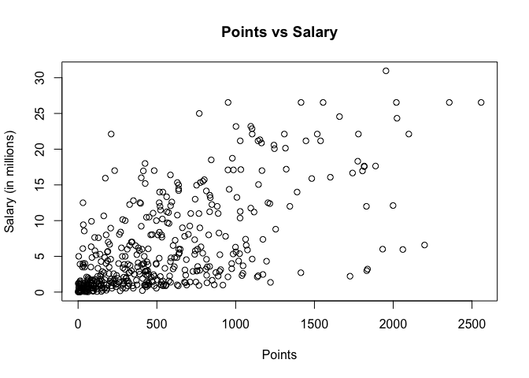
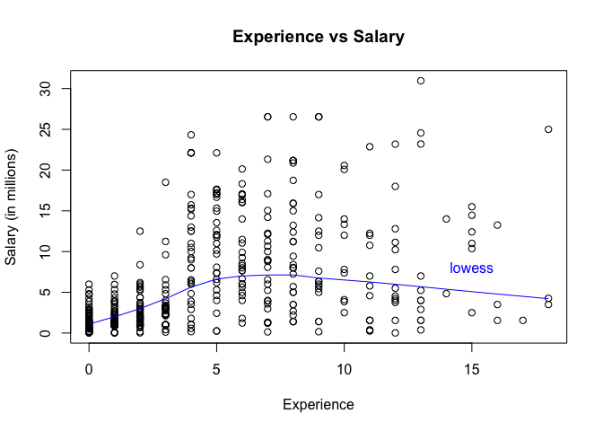
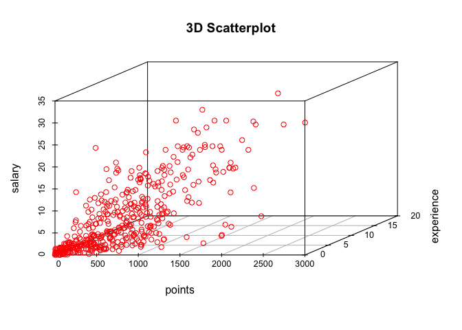
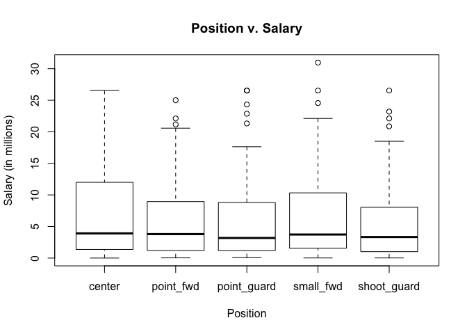

HW01
================
Deborah Chang

```{r setup, include=FALSE}
knitr::opts_chunk$set(error = TRUE)
load("data/nba2017-salary-points.RData")
# list available objects
ls()
library(scatterplot3d)
```
### 1) A bit of data preprocessing

``` r
salaryMil <- salary / 10^6
newExp <- as.integer(replace(experience, experience == "R", "0"))
factored <- as.factor(position)
levels(factored) <- c("center", "small_fwd", "power_fwd", "shoot_guard", "point_guard")
table(factored)
```

    ## factored
    ##      center   small_fwd   power_fwd shoot_guard point_guard 
    ##          89          89          85          83          95

### 2) Scatterplot of Points and Salary

``` r
plot(points, salaryMil, main = "Points vs Salary", xlab = "Points", ylab = "Salary")
```



### 3) Correlation between Points and Salary

``` r
numberOfIndividuals <- length(player)
numberOfIndividuals
```

    ## [1] 441

``` r
sumPoints <- sum(points)
sumPoints
```

    ## [1] 241053

``` r
sumSalary <- sum(salaryMil)
sumSalary
```

    ## [1] 2728.473

``` r
averagePoints <- sumPoints / length(points)
averagePoints
```

    ## [1] 546.6054

``` r
averageSalary <- sumSalary / length(salaryMil)
averageSalary
```

    ## [1] 6.187014

``` r
variancePoints <- (sum((points - averagePoints)^2)) / (numberOfIndividuals -1)
variancePoints
```

    ## [1] 239136.2

``` r
varianceSalary <- (sum((salaryMil - averageSalary)^2)) / (numberOfIndividuals -1)
varianceSalary
```

    ## [1] 43.18973

``` r
sdevPoints <- sqrt(variancePoints)
sdevPoints
```

    ## [1] 489.0156

``` r
sdevSalary <- sqrt(varianceSalary)
sdevSalary
```

    ## [1] 6.57189

``` r
#covariance
mult <- (points - averagePoints) * (salaryMil - averageSalary)

covariance <- sum(mult) / (numberOfIndividuals -1)
covariance
```

    ## [1] 2046.213

``` r
correlation <- covariance / (sdevPoints*sdevSalary)
correlation
```

    ## [1] 0.6367043

### 4) Simple Linear Regression

``` r
slope <- correlation * (sdevSalary/sdevPoints)
slope
```

    ## [1] 0.008556681

``` r
intercept <- averageSalary - (slope*averagePoints)
intercept
```

    ## [1] 1.509886

``` r
yHat <- intercept + (slope*points)

summary(yHat)
```

    ##    Min. 1st Qu.  Median    Mean 3rd Qu.    Max. 
    ##   1.510   2.845   5.206   6.187   8.184  23.398

-   *y**H**a**t* = *s**l**o**p**e* \* *p**o**i**n**t**s* + *i**n**t**e**r**c**e**p**t*
-   yHat = 0.008556681\*points + 1.509886

The slope coefficient displays the rate at which salary increases by a number of points. The intercept shows the salary earned when a player scores 0 points.

-   0 points: 1509886
-   100 points: 2365554
-   500 points: 5788226
-   1000 points: 10066567
-   2000 points: 18623248

### 5) Plotting the regression line

``` r
plot(points, salaryMil, main = "Points vs Salary", xlab = "Points", ylab = "Salary (in millions")
abline(lm(salaryMil~points), col = "red")
lines(lowess(points, salaryMil), col = "blue")
text(2400, 19, labels = "regression", col = "red")
text(2500, 30, labels = "lowess", col = "blue")
```


### 6) Regression residuals and Coefficient of Determination

``` r
residuals <- salary - yHat
summary(residuals)
```

    ##     Min.  1st Qu.   Median     Mean  3rd Qu.     Max. 
    ##     5143  1286157  3499998  6187008  9249992 30963432

``` r
RSS <- sum((residuals)^2)
RSS
```

    ## [1] 3.588454e+16

``` r
SquaredSal <- (salary - averageSalary)^2
TSS <- sum(SquaredSal)
TSS
```

    ## [1] 3.588455e+16

``` r
Rsquare <- 1- (RSS/TSS)
Rsquare
```

    ## [1] 4.293693e-07

### 7) Exploring Position and Experience

#### Scatterplot

``` r
RExp <- replace(experience, experience == "R", 0)
IntExp <- as.integer(RExp)
plot(IntExp, salaryMil, main = "Experience vs Salary", xlab = "Experience", ylab = "Salary (in millions")
lines(lowess(IntExp, salaryMil), col = "blue")
text(15, 8, labels = "lowess", col = "blue")
```



-   The scatterplot seems to depict that the less experience that a player has, the lower salary they earn. There is a significant cluster among the 0 to 5 years of experience for players, and the rest of points on the plot increasingly scatter as the years of experience increase, possibly based on other factors.

#### 3D Scatterplot

``` r
scatterplot3d(x = points, y = IntExp, z = salaryMil)
```



-   The 3D scatterplot seems to be more positively linear, based on observation. Again, there is a heavy cluster for players with very low salaries, points, and experience. As years of experience increase, the scatter is still moderately linear but starts to have a larger spread among others with similar statistics

#### Boxplot

``` r
boxplot(salaryMil~position, main = "Position v. Salary", xlab = "Position", ylab = "Salary (in millions)")
```



The boxplot depicts the salaries of the five positions. From observation, the center position has the larger spread without outliers, and seems to have a higher potential of earning a higher salary. For the other positions, variation is lower but with some outliers.

From the scatterplots, experience seems to be associated with salary through the moderately positive linearities, but the strength of association cannot be determined, as there is a higher scatter among players with more experience. Again, this may be based on another variable.

From the boxplot, it is harder to say whether position is related to salary, as there is a consistent amount of similar variance among the positions. The means and overall quartiles seem to be around the same salary, with the exception of the center position having a higher spread. Though the highest salary is from the center position, this case seems to be an exception, as the majority of players, regardless of position, make about the same.

### 8) Comments and Reflections

-   Some things that were challenging were applying the arguments and functions into my plots.
-   Some straightforward items were analyzing the variables through regression and correlation.
-   The tutorial was helpful for git and GitHub.
-   I utilized office hours and my GSI for guidance in plotting graphs.
-   It took over five hours to complete this HW. The most consuming part was troubleshooting.
-   I was able to grasp the concepts of this assignment. Most of the assigment was straightforward.
-   I was excited to be able to learn how Git and GitHub works and integrates with R Markdown.
