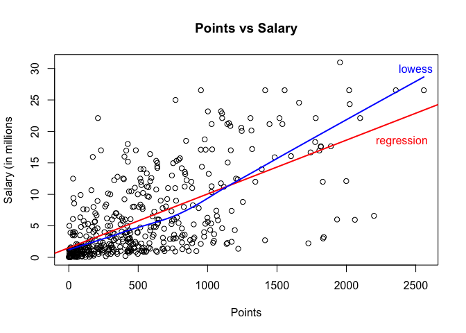

hw01-deborah-chang.Rmd
================

### 1) A bit of data preprocessing

``` r
salaryMil <- salary / 10^6
newExp <- as.integer(replace(experience, experience == "R", "0"))
factored <- as.factor(position)
levels(factored) <- c("center", "small_fwd", "power_fwd", "shoot_guard", "point_guard")
table(factored)
```

    ## factored
    ##      center   small_fwd   power_fwd shoot_guard point_guard 
    ##          89          89          85          83          95

### 2) Scatterplot of Points and Salary

``` r
plot(points, salaryMil, main = "Points vs Salary", xlab = "Points", ylab = "Salary")
```


### 3) Correlation between Points and Salary

``` r
numberOfIndividuals <- length(player)
numberOfIndividuals
```

    ## [1] 441

``` r
sumPoints <- sum(points)
sumPoints
```

    ## [1] 241053

``` r
sumSalary <- sum(salaryMil)
sumSalary
```

    ## [1] 2728.473

``` r
averagePoints <- sumPoints / length(points)
averagePoints
```

    ## [1] 546.6054

``` r
averageSalary <- sumSalary / length(salaryMil)
averageSalary
```

    ## [1] 6.187014

``` r
variancePoints <- (sum((points - averagePoints)^2)) / (numberOfIndividuals -1)
variancePoints
```

    ## [1] 239136.2

``` r
varianceSalary <- (sum((salary - averageSalary)^2)) / (numberOfIndividuals -1)
varianceSalary
```

    ## [1] 8.15558e+13

``` r
sdevPoints <- sqrt(variancePoints)
sdevPoints
```

    ## [1] 489.0156

``` r
sdevSalary <- sqrt(varianceSalary)
sdevSalary
```

    ## [1] 9030825

``` r
#covariance
mult <- (points - averagePoints) * (salary - averageSalary)

covariance <- sum(mult) / (numberOfIndividuals -1)
covariance
```

    ## [1] 2046212512

``` r
correlation <- covariance / (sdevPoints*sdevSalary)
corrrelation
```

    ## Error in eval(expr, envir, enclos): object 'corrrelation' not found

### 4) Simple Linear Regression

``` r
slope <- sum(mult) / sum(points - averagePoints)
slope
```

    ## [1] 1.131345e+23

``` r
intercept <- averageSalary - (slope*averagePoints)
intercept
```

    ## [1] -6.183995e+25

``` r
yHat <- intercept + (slope*points)

summary(yHat)
```

    ##       Min.    1st Qu.     Median       Mean    3rd Qu.       Max. 
    ## -6.184e+25 -4.419e+25 -1.297e+25  3.938e+09  2.640e+25  2.276e+26

``` r
###write inline equation here
```

The slope coefficient displays the rate at which salary increases by a number of points. The intercept shows the salary earned when a player scores 0 points.

-   0 points: 1509886
-   100 points: 2365554
-   500 points: 5788226
-   1000 points: 10066566
-   2000 points: 18623247

### 5) Plotting the regression line

``` r
plot(points, salaryMil, main = "Points vs Salary", xlab = "Points", ylab = "Salary")
```



### 6) Regression residuals and Coefficient of Determination

### 7) Exploring Position and Experience

### 8) Comments and Reflections

-   Some things that were challenging were applying the arguments and functions into my plots.
-   Some straightforward items were analyzing the variables through regression and correlation.
-   The tutorial was helpful for git and GitHub.
-   I utilized office hours and my GSI for guidance in plotting graphs.
-   It took over five hours to complete this HW. The most consuming part was troubleshooting.
-   I was able to grasp the concepts of this assignment. Most of the assigment was straightforward.
-   I was excited to be able to learn how Git and GitHub works and integrates with R Markdown.
