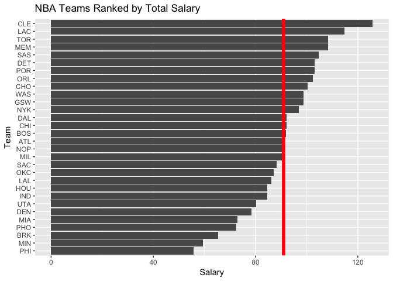
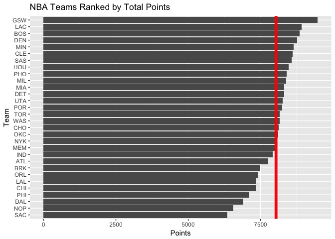
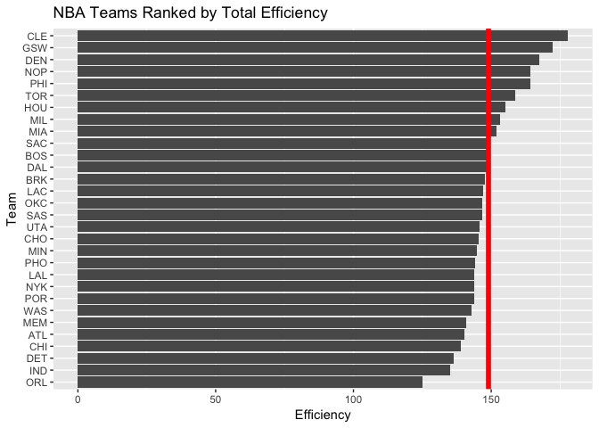
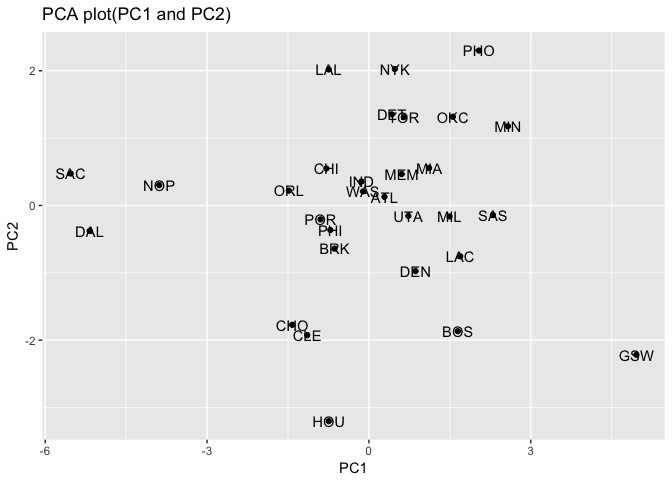
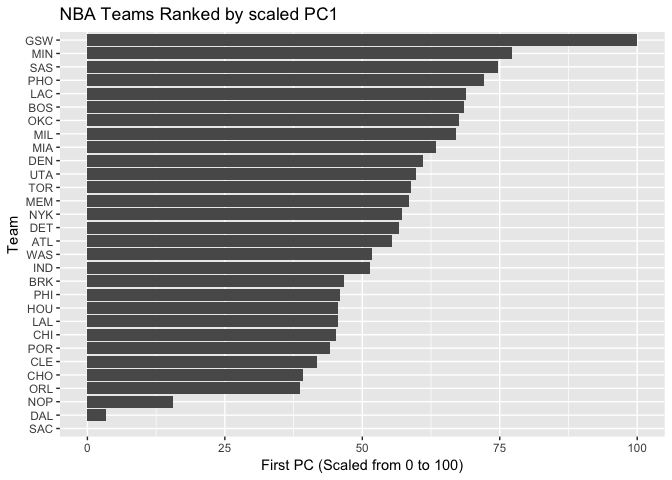

HW 03
================

``` r
knitr::opts_chunk$set(echo = TRUE)
library(readr)
library(dplyr)
```

    ## 
    ## Attaching package: 'dplyr'

    ## The following objects are masked from 'package:stats':
    ## 
    ##     filter, lag

    ## The following objects are masked from 'package:base':
    ## 
    ##     intersect, setdiff, setequal, union

``` r
library(ggplot2)
```

Basic Rankings
--------------

``` r
library(scales)
```

    ## 
    ## Attaching package: 'scales'

    ## The following object is masked from 'package:readr':
    ## 
    ##     col_factor

``` r
nbaRoster <- read.csv('/Users/deborahchang/Desktop/stat133/stat133-hws-fall17/hw03/data/nba2017-roster.csv')
nbaStats <- read.csv('/Users/deborahchang/Desktop/stat133/stat133-hws-fall17/hw03/data/nba2017-stats.csv')


# Adding New Variables
nbaStats <- mutate(nbaStats, missed_fg = nbaStats$field_goals_atts - field_goals_made, 
       missed_ft = nbaStats$points1_atts - nbaStats$points1_made, 
       points = 3*nbaStats$points3_made + 2*nbaStats$points2_made + nbaStats$points1_made,
       rebounds = nbaStats$off_rebounds + nbaStats$def_rebounds, efficiency = 
         (points + rebounds + assists + steals + blocks - missed_fg - missed_ft
          - turnovers) / games_played)
merged <- merge(nbaRoster, nbaStats)
merged$salary <- merged$salary / 10^6
team <- unique(sort(merged$team))
experience <- select(aggregate(merged$experience, by = list(merged$team), FUN = "sum"), 2)
salary <- select(aggregate(merged$salary, by = list(merged$team), FUN = "sum"), 2)
points3 <- select(aggregate(merged$points3_made, by = list(merged$team), FUN = "sum"), 2)
points2 <- select(aggregate(merged$points2_made, by = list(merged$team), FUN = "sum"), 2)
free_throws <- select(aggregate(merged$points1_made, by = list(merged$team), FUN = "sum"), 2)
points <- select(aggregate(merged$points, by = list(merged$team), FUN = "sum"), 2)
off_rebounds <- select(aggregate(merged$off_rebounds, by = list(merged$team), FUN = "sum"), 2)
def_rebounds <- select(aggregate(merged$def_rebounds, by = list(merged$team), FUN = "sum"), 2)
assists <- select(aggregate(merged$assists, by = list(merged$team), FUN = "sum"), 2)
steals <- select(aggregate(merged$steals, by = list(merged$team), FUN = "sum"), 2)
blocks <- select(aggregate(merged$blocks, by = list(merged$team), FUN = "sum"), 2)
turnovers <- select(aggregate(merged$turnovers, by = list(merged$team), FUN = "sum"), 2)
fouls <- select(aggregate(merged$fouls, by = list(merged$team), FUN = "sum"), 2)
efficiency <- select(aggregate(merged$efficiency, by = list(merged$team), FUN = "sum"), 2)


teams <- data.frame(team, experience, salary,points3,points2,free_throws,points, 
                    off_rebounds,def_rebounds,assists,steals,blocks,turnovers,fouls,efficiency)
names(teams) [1:15] = c("team","experience", "salary", "points3", "points2", "free_throws", 
                        "points", "off_rebounds", "def_rebounds", "assists", 
                        "steals", "blocks", "turnovers","fouls", "efficiency")
```

``` r
ggplot(teams, aes(x = reorder(teams$team, teams$salary), y = teams$salary)) + ggtitle(label = "NBA Teams Ranked by Total Salary") + geom_bar(stat = 'identity') + coord_flip()+labs(x = "Team", y = "Salary") + geom_hline(yintercept = mean(teams$salary), linetype = "solid", color = "red", size = 2)
```



``` r
plotPoints <- ggplot(teams, aes(x = reorder(teams$team, teams$points), y = teams$points)) + ggtitle(label = "NBA Teams Ranked by Total Points") + geom_bar(stat = 'identity') + coord_flip() + labs(x = "Team", y = "Points") 
plotPoints + geom_hline(yintercept = mean(teams$points), linetype = "solid", color = "red", size = 2)
```



``` r
library(scales)
ggplot(teams, aes(x = reorder(teams$team, teams$efficiency), y = teams$efficiency)) + ggtitle(label = "NBA Teams Ranked by Total Efficiency") + geom_bar(stat = 'identity') + coord_flip()+labs(x = "Team", y = "Efficiency") + geom_hline(yintercept = mean(teams$efficiency), linetype = "solid", color = "red", size = 2)
```



#### Descriptions

Comparing the different trends in salary, points, and efficiency, there does not seem to be a strong correlation for a particular team. However, higher-paid teams, such as CLE, will be on the upper end in total efficiency and total number of points. In particular, the figure "Total Salary", contains the average salary overall to be on the upper end, in the mid 80s. In "Total Points," there is less of a disparity among other teams, in terms of the total number of points. Finally, in "Total Efficiency," the overall factors seem to balance out team performance in general.

Principal Components Analysis (PCA)
-----------------------------------

``` r
variables <- data.frame(teams$points3, teams$points2, teams$free_throws, teams$off_rebounds,teams$def_rebounds, teams$assists, teams$steals, teams$blocks, teams$turnovers, teams$fouls)

pca <- prcomp(variables, scale. = TRUE)
eigs <- data.frame(eigenvalue = pca$sdev^2, proportion = pca$sdev^2/sum(pca$sdev^2), cumprop = cumsum(apply(pca$x,2,var)/ sum(apply(pca$x,2,var))))

ggplot(teams, aes(pca$x[,1], pca$x[,2])) + geom_point() + geom_text(aes(label=teams$team)) + labs(title = "PCA plot(PC1 and PC2)", x="PC1", y="PC2")
```



``` r
##interpreting PCs with calculating correlation and such
cor(teams$points3, pca$x[,1])
```

    ## [1] 0.2430901

``` r
cor(teams$points2, pca$x[,1])
```

    ## [1] 0.7805026

``` r
cor(teams$free_throws, pca$x[,1])
```

    ## [1] 0.6994128

``` r
cor(teams$off_rebounds, pca$x[,1])
```

    ## [1] 0.6564635

``` r
cor(teams$def_rebounds, pca$x[,1])
```

    ## [1] 0.8060007

``` r
cor(teams$assists, pca$x[,1])
```

    ## [1] 0.677255

``` r
cor(teams$steals, pca$x[,1])
```

    ## [1] 0.7470202

``` r
cor(teams$blocks, pca$x[,1])
```

    ## [1] 0.6852567

``` r
cor(teams$turnovers, pca$x[,1])
```

    ## [1] 0.7268024

``` r
cor(teams$fouls, pca$x[,1])
```

    ## [1] 0.665821

``` r
pca$rotation
```

    ##                          PC1         PC2         PC3          PC4
    ## teams.points3      0.1121782 -0.65652993  0.28806873 -0.042637313
    ## teams.points2      0.3601766  0.32892544 -0.06763180 -0.347710703
    ## teams.free_throws  0.3227564 -0.17651228  0.39157491  0.147596178
    ## teams.off_rebounds 0.3029366  0.35931603  0.33884845 -0.288483019
    ## teams.def_rebounds 0.3719432 -0.12808273  0.15026131 -0.492969442
    ## teams.assists      0.3125312 -0.44134618 -0.26294129 -0.088066602
    ## teams.steals       0.3447256 -0.03540585 -0.48554101  0.177578661
    ## teams.blocks       0.3162237  0.06131890 -0.48869371  0.003935374
    ## teams.turnovers    0.3353958 -0.02169833  0.08910421  0.532117541
    ## teams.fouls        0.3072548  0.28954426  0.26469871  0.454751471
    ##                            PC5          PC6         PC7         PC8
    ## teams.points3       0.28657624 -0.028435666  0.38167878  0.18027569
    ## teams.points2      -0.15173866 -0.088714347  0.07302430 -0.47216199
    ## teams.free_throws  -0.21363792 -0.487342521 -0.62732220  0.07726675
    ## teams.off_rebounds -0.16571824  0.283093235  0.13535335  0.64646479
    ## teams.def_rebounds  0.26476256  0.066309015 -0.04926346 -0.23787252
    ## teams.assists      -0.36972525  0.176019008  0.11785039 -0.18235775
    ## teams.steals       -0.33549491 -0.303664534  0.25883825  0.32703573
    ## teams.blocks        0.65459381 -0.009954065 -0.30799231  0.23947533
    ## teams.turnovers    -0.04471763  0.675777660 -0.18850849 -0.14308362
    ## teams.fouls         0.26814214 -0.298848473  0.47268121 -0.21462859
    ##                            PC9         PC10
    ## teams.points3      -0.20631322  0.409762462
    ## teams.points2      -0.35836740  0.499011524
    ## teams.free_throws  -0.08283563 -0.006875686
    ## teams.off_rebounds -0.14735551 -0.124601143
    ## teams.def_rebounds  0.64632050 -0.168579984
    ## teams.assists      -0.34086739 -0.547385461
    ## teams.steals        0.41596580  0.246739300
    ## teams.blocks       -0.27071160 -0.057627209
    ## teams.turnovers     0.13524769  0.250947823
    ## teams.fouls        -0.04367200 -0.335087245

### Index based on PC1

``` r
pc1 <- pca$x[ ,1]
transformed <- 100 *((pc1 -min(pc1))/ (max(pc1) - min(pc1)))
ggplot(teams, aes(x = reorder(teams$team, transformed), y = transformed)) + ggtitle(label = "NBA Teams Ranked by scaled PC1") + geom_bar(stat = 'identity') + coord_flip() + labs(x = "Team", y = "First PC (Scaled from 0 to 100)") 
```



As the barplot shows, PC1 captures the maximum variability among the variables yet condenses such information. As mentioned in lecture, the PCs are evaluated as a linear combination of weights and variables. As shown in the figure, the Warriors seem to have the highest rank based on overall input from each variable, balanced by the PC weights. This technique seems to provide a more generalized and holistic perspective in analyzing the team rankings.

Comments and Reflections
------------------------

-   The harder and more time consuming parts were determining the eigenvalues and the PCs, and organizing them into a data frame.
-   Yes, this is my first time starting from scratch - from setting up the file structure to analysis.
-   I have used relative paths before, as well as R scripts.
-   Preparing the data was more straightforward.
-   I used GSI office hours.
-   I enjoyed being able to use different visualizations and techniques to rank the teams.
