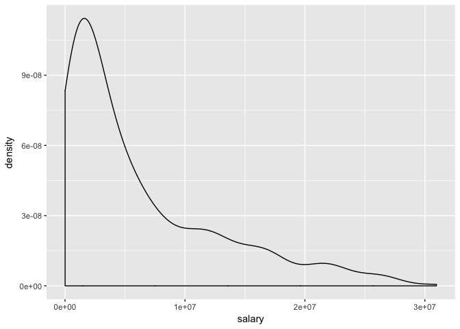
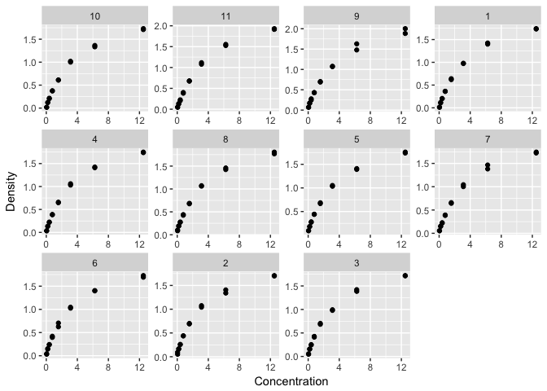
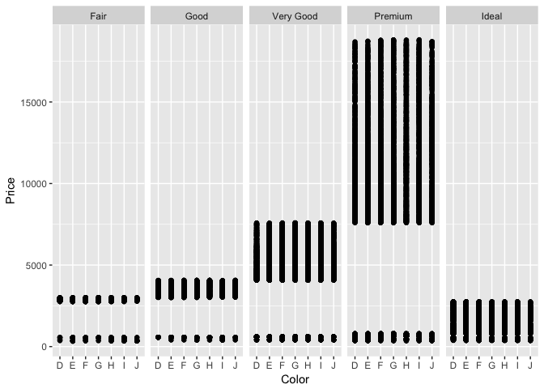

Post \#1: Ggplot and its Applications: Faceting and Some Features
================
Deborah Chang
10/31/2017

Introduction
------------

R has numerous features that can beautify our data and graphically appeal to the audience. From different analysis tools to functions that can summarize a whole bunch of data, R packages seem to contain more options than we can ever imagine. As I continue to dive deeply into more data analysis, download more datasets, and perform certain techniques to determine a holistic answer to a research question, I enjoyed the efficient help documentations and new tips on creating concise reports and analyses. One certain package, ggplot2, has caught my eye for a little while. As I delved into the lab, I discovered new functions and features that were aesthetically concise and pleasing to the eye of the audience. Developed by Hadley Wickham, the ggplot2 package has numerous selections of chart types, modifications, and features to the user’s delight. As I excitedly finished learning how to create scatterplots and star plots with neat functions, I stumbled across the very last exercise in the lab, which was faceting. I was amazed at the different perspectives that faceting provided, and how much information data can hold across one variable. Below is an example of faceting (what caught my eye in the first place):


Faceting has brought much interest to users lately, bringing a new perspective of presenting multiple sets of categorical variable.

Motivation
----------

So what exactly is faceting? According to a Harvard tutorial (referenced below), “faceting is a ggplot2 parlance for small multiples: the idea is to create separate graphs for subsets of data.” Similarly, if I want to compare the effect of salaries of people to their health and well-being, I could split up the categorical variable of people into different age groups. A categorical variable is qualitative information about an observation i.e. gender, level, hometown, etc. Often, these variables could be classified into factors, which are used to handle categorical data. Then, I could graph each age group in its own visual and have multiple graphs lined up together. I could now better visualize what’s going on for each age group. For example, if I created scatterplots, there would be less results to weave through and better views of certain patterns and relationships within and among age groups in relation to salaries. Faceting is a great tool to use for anyone. Here, I will show you a couple of features of the faceting function that I found useful. But first, I will take you through a quick short tutorial on how to use ggplot and faceting in general.

Background
----------

As mentioned, faceting splits data into different subgroups for deeper analysis. I could facet with more than one variable, and there are truly no limits to how many features there are to faceting. Here is an interesting example of faceting:


I like how this visual is partitioned by state; there are multiple pieces of information per plot, and colorful bars to color code each variable. Imagine if all this information were condensed into one plot. There would be too many color bars and variables to repeat for each state, not to mention the confusion one might experience from viewing a giant graph of multiple variables and states.

Examples
--------

Firstly, to begin creating my visual, I would do the usual ggplot() function and use the ‘+’ operator to add additional aesthetics. Refer to <https://cran.r-project.org/web/packages/ggplot2/ggplot2.pdf> for more information on how to plot. Here is a sample code that you can try on graphing a density plot:

``` r
ggplot(data = dat, aes(salary)) + geom_density()
```


I always need the ggplot() function with the respective variables I want to measure. The operators are for the specification of the type of visual I want as well as the labels and titles I want to incorporate. I would finally add another ‘+’ operator before utilizing the faceting function.

There are two types of faceting functions in ggplot2. One is facet\_grid(). It places the subset visuals in a grid-like format, and can be done so in a horizontal or vertical format. Below is an example of a scatterplot coded with the facet\_grid function from the cookbook:


As you can see, the plots are arranged by day and gender. I can better pinpoint and approximate how much a female would typically pay on Saturday compared to the bill of a male.

Another type of faceting is called facet\_wrap(). This function brings each plot next to each other, by column or by row; your choice. Here is an example (again, from the cookbook):


The new feature that I learned is the "scales" argument of the faceting function. Here is a faceting plot that I created with this new function:

``` r
ggplot(data = DNase, aes(x =DNase$conc, y = DNase$density)) + geom_point() + facet_wrap(~ DNase$Run, scales = "free") +
  xlab("Concentration") + ylab("Density") 
```

 This scatterplot arranges the concentration and densities of the solution by the run. Hence, maybe an answer that we could be seeking is the effect of density on concentration, or vice versa. The "free" option denotes that the scales are different among both rows and columns in this example. This feature is available in facet\_grid() as well.

I used an additional feature, "space," to provide proportional perspectives for the panels. "Fixed" gives the panels the same size. "free\_x" only provides proportions to the x scale, and "free" will do for both.

Here is a plot with the space argument for both scales:

``` r
ggplot(data = diamonds, aes(x =diamonds$color, y = diamonds$price)) + geom_point() + facet_grid(~diamonds$cut, space = "free") + xlab("Color") + ylab("Price")
```



``` r
# adding density plot function
# adding facet grid
```

This plot arranges the diamonds by cut, for analysis on whether price is related to the cut and color.

If I wanted to add another variable to wrap, I would use a vector, such as c(“cut”, “color""), cut~color, or ~cut + color.

One other neat feature of creating facet visuals that I want to introduce is the use of the argument “labeller.” We can adjust the names of the visuals and variables with these different functions:

Label\_value(): Shows factor value Label\_both(): Name and value Label\_context(): Based on context Label\_parsed(): Viewed as math expression Label\_wrap\_gen(): Wraps line

Here is an application of labeller, using the "DNase" datset again:

``` r
ggplot(data = DNase, aes(x =DNase$conc, y = DNase$density)) + geom_point() + facet_wrap(~ DNase$Run, labeller = label_both) +
  xlab("Concentration") + ylab("Density") 
```



This displays both the names of the factor(DNase$Run) and the run number at the top of the visuals for each plot.

Discussion
----------

Faceting definitely brings out new insights that one may not easily notice in an aggregated visual. With the numerous amounts of data coming in through all various industries, never has analysis become much more convenient with the features of ggplot. Especially in analytics today, faceting can bring better observations for companies. For example, in the business or healthcare industries, faceting in R can better clear up overlaps and potential third variables. With the numerous resources and documentations of faceting functions and features, more information can be dug out of our data.

Conclusions
-----------

Data is exciting different industries today. All inputs in our daily lives utilize data in some way, and it doesn’t seem to be stopping any time soon. Data is endless. The limits of data stretch beyond the horizons. With faceting, data can be even better applied and visualized.

The next steps of faceting could be generating more 3D models of visuals. How cool does that sound? I never knew about faceting until coming across this course, and specifically, the ggplot2 package. There must be more features ahead…

Take-Home Message
-----------------

Facets really do bring a new perspective of visualizing data. The different examples and functions that faceting brings can allow users to better analyze data across the subgroups of categorical variables. With growing excitement about the immense access and use of data, ggplot2 allows much efficiency and interactivity of creating visuals across different dimensions. Try it out when you get the chance. Faceting is neat and interactive to use.

References
----------

-   Facets (ggplot2). N.p., n.d. Web.
-   "Ggplot2: Facet\_wrap Strip Color Based on Variable in Data Set." R - Ggplot2: Facet\_wrap Strip Color Based on Variable in Data Set - Stack Overflow. N.p., n.d. Web.
-   Holtz, |. "\#223 Faceting with Ggplot2." The R Graph Gallery. N.p., 10 Feb. 2017. Web.
-   "Lay out Panels in a Grid." Lay out Panels in a Grid - Facet\_grid • Ggplot2. N.p., n.d. Web.
-   "Useful Labeller Functions." Useful Labeller Functions - Labellers • Ggplot2. N.p., n.d. Web.
-   "Using Faceting in Ggplot2 to Create Trellis-like Plots." R-bloggers. N.p., 11 May 2011. Web.
-   "Wrap a 1d Ribbon of Panels into 2d." Wrap a 1d Ribbon of Panels into 2d - Facet\_wrap • Ggplot2. N.p., n.d. Web.
